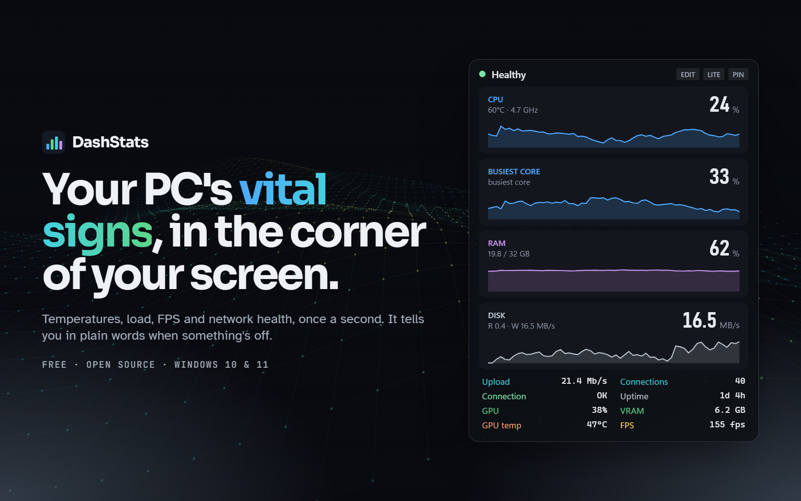
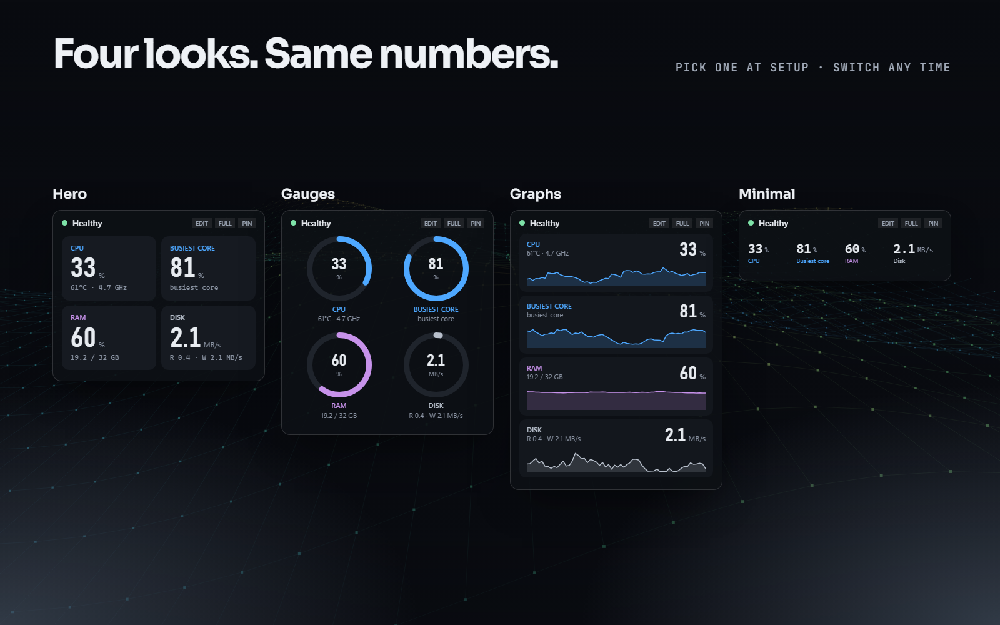
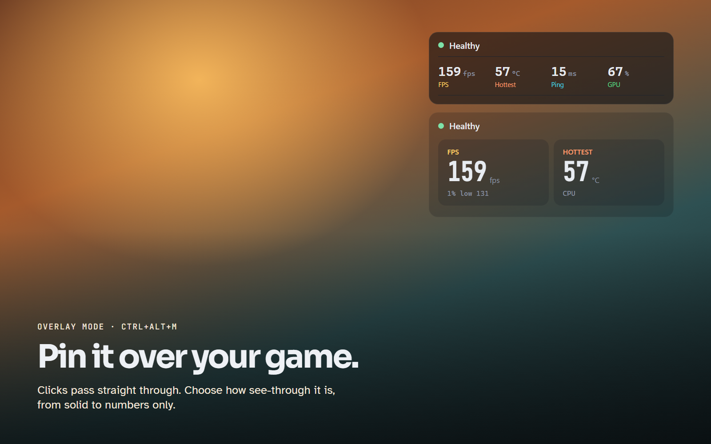

# DashStats

**Your PC's vital signs, in the corner of your screen.** A small widget for Windows that shows temperatures, load, FPS and network health once a second, and tells you in plain words when something's off.

[**Download**](https://github.com/Varazi/dash-stats/releases/latest) · [Website](https://varazi.github.io/dash-stats/) · [Buy me a coffee](https://ko-fi.com/varazi)

Free and open source (MIT). Windows 10 and 11, 64-bit.

## What it shows

- **CPU:** load, temperature, clock speed, power, busiest core
- **GPU:** load, temperature and hotspot, clocks, VRAM, power, fan, video encoder. NVIDIA, AMD and Intel.
- **FPS** for the app in front: frame rate, 1% lows, frame time, stutters. Any game, any graphics card.
- **Network:** speeds, ping, jitter, packet loss, router ping, retransmits, a log of hiccups
- **Memory, disks, battery,** uptime and total power draw

The header says what's wrong in words ("GPU temp: 86°C", "Network: drops on your Wi-Fi"). It pings both your router and the internet, so it can tell weak Wi-Fi from a bad internet provider.

## It builds itself

The first time you run it, it asks what you use the PC for (gaming, coding, hosting a server, AI training, streaming…) and picks the stats that matter for that. Then pick one of four looks. Switch any time with **EDIT**.

By default it sits on the desktop behind your windows. Pin it with `Ctrl+Alt+M` and it floats over everything, borderless games included, with clicks passing straight through. Choose how see-through it is, from solid to numbers only.

## Install

1. Download `DashStats.exe` from the [latest release](https://github.com/Varazi/dash-stats/releases/latest) and double-click it. Nothing else to install.
2. If Windows says "Windows protected your PC", click **More info**, then **Run anyway**. The app isn't code-signed yet.
3. Click **Yes** at the admin prompt (needed to read temperatures and frame rates), then **Yes** to set it up.

Setup copies DashStats to `C:\Program Files\DashStats`, starts it when you sign in, adds a Start menu shortcut and installs the PawnIO sensor driver if it's missing. DashStats checks for updates every few hours and asks before installing one. To remove it, use tray → *Settings* → *Uninstall…*.

## Controls

| Action | How |
|---|---|
| Choose what to monitor and the look | **EDIT** in the widget header, or tray → *Change what I monitor…* |
| Pin over everything, click-through | `Ctrl+Alt+M` or **PIN**. Unpin with `Ctrl+Alt+M` or tray → *Unpin widget* |
| Full or lite view | `Ctrl+Alt+L` or the **LITE** / **FULL** button |
| Hide or show | `Ctrl+Alt+H` or left-click the tray icon |
| Move | Drag it. It snaps to the nearest corner. |

Right-click the tray icon (near the clock) for everything else.

## Privacy

No account, no ads, no tracking. DashStats only goes online to ping `1.1.1.1` and your router (for the ping and packet-loss readings) and to check GitHub for new versions. Settings and logs stay on your PC in `%APPDATA%\DashStats`.

## Known limitations

- **Smart App Control** (on some newer Windows 11 PCs) blocks unsigned apps outright. Check Windows Security → App & browser control.
- Exclusive-fullscreen games draw over every window. Use borderless or windowed fullscreen to see the pinned widget.
- Without the PawnIO driver, CPU temperature and CPU power aren't available. Everything else still works.

Found a bug? [Open an issue](https://github.com/Varazi/dash-stats/issues/new/choose). The bug report form explains how to attach the log.

## Building from source

See [BUILDING.md](BUILDING.md) for the toolchain, the build commands, how releases are made and how the bundled tools get in. In short: install the .NET 10 SDK and run `.\build.ps1`.

## Credits

Sensors come from [LibreHardwareMonitor](https://github.com/LibreHardwareMonitor/LibreHardwareMonitor) with the [PawnIO](https://github.com/namazso/PawnIO) driver; frame rates from Intel's [PresentMon](https://github.com/GameTechDev/PresentMon). Their licenses are in [THIRD-PARTY-NOTICES.md](THIRD-PARTY-NOTICES.md).

DashStats is released under the [MIT license](LICENSE).
